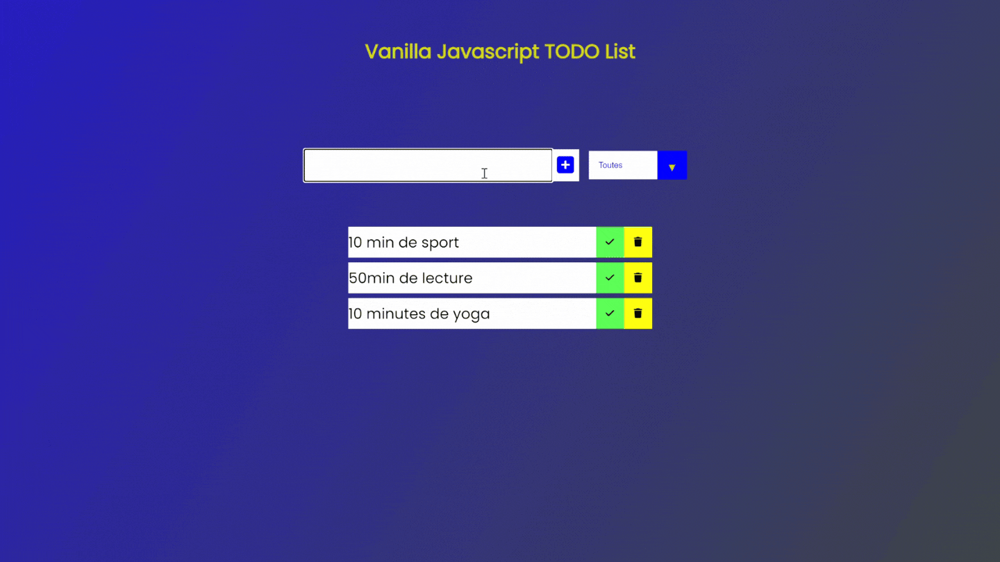

# Vanilla-Javascript-Todo-List

Réalisation d'une TODO list en javascript vanilla !

L'objectif : créer une todo list

Ce que j'ai appris en javascript : 

-> utilisation de la fonction : appendchild().    

-> utilisation des parentElements et childElements d'un objet.  

-> mieux utiliser les écouteurs d'événements.  

-> meilleurs organisations de mon code.

Résultats :

